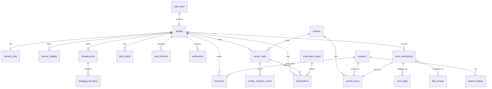

# Lagos Market Intelligence — Backend Schema

**Version 1.0 · July 2026**  
**Companion docs:** PRD v1.0 · App Flow v1.1 · TECH_STACK v2.0 · Content Guidelines v1.0

This document is the authoritative reference for the LMI database schema, Supabase configuration, and NestJS API surface. Runnable SQL lives in `supabase/migrations/`.

---

## Table of Contents

1. [Architecture Decisions](#1-architecture-decisions)
2. [Entity Relationship Diagram](#2-entity-relationship-diagram)
3. [Authentication](#3-authentication)
4. [Tables](#4-tables)
5. [Relationships](#5-relationships)
6. [Indexes](#6-indexes)
7. [Database Functions](#7-database-functions)
8. [Triggers](#8-triggers)
9. [Row Level Security](#9-row-level-security)
10. [Storage Buckets](#10-storage-buckets)
11. [Permissions & Roles](#11-permissions--roles)
12. [API Endpoints](#12-api-endpoints)
13. [Cron Jobs](#13-cron-jobs)
14. [Future Extensions](#14-future-extensions)

---

## 1. Architecture Decisions

| Decision | Choice | Rationale |
|----------|--------|-----------|
| Price storage | **Hybrid** — `price_submissions` (history) + `current_prices` (denormalized) | Sub-400ms comparison queries; full audit trail for charts and moderation |
| Reporter vs vendor prices | **Unified** `price_submissions` with `source` enum | Single comparison query, shared flagging flow |
| Client data access | **NestJS only** for business reads/writes | Matches TECH_STACK; RLS is defense-in-depth |
| Auth | **Supabase Auth** (phone OTP, email/password, Google OAuth) | Mobile uses `@supabase/supabase-js`; API verifies JWT via JWKS |
| Images | **Supabase Storage** (not Cloudinary) | TECH_STACK v2.0 override |
| Currency | **Integer Naira** in price tables; **kobo** in Paystack tables | No decimals in market prices; Paystack convention |
| Timezone | **Africa/Lagos (WAT)** in application/cron logic | All columns use `timestamptz` |
| Shopping lists | **One list per user** | App Flow v1 |
| Vendor stalls | **One stall per vendor** | App Flow v1 |
| Freemium limits | Enforced in **NestJS**; `check_freemium_limit()` available in DB | 5 list items, 3 alerts, 10 favourites (free) |

---

## 2. Entity Relationship Diagram



---

## 3. Authentication

### 3.1 Supabase Auth Providers

| Provider | Priority | Flow |
|----------|----------|------|
| Phone OTP | Must Have | `signInWithOtp` → `verify-otp` screen |
| Email + password | Must Have | `signUp` / `signInWithPassword` |
| Google OAuth | Should Have | `signInWithOAuth` + Expo AuthSession |

### 3.2 Profile Bootstrap

On `auth.users` INSERT → trigger `handle_new_user()` creates:

- `profiles` row (display name from metadata or email/phone)
- `notification_preferences` with defaults
- `shopping_lists` empty list

Role is set from `raw_user_meta_data.role` at signup **except** `admin` (server-assigned only).

### 3.3 Session Flow

```
Mobile → Supabase Auth (SecureStore session)
Mobile → NestJS API with Authorization: Bearer <access_token>
NestJS → jose JWKS verification → load profiles.role + account_status
```

### 3.4 Account States

| Status | Behaviour |
|--------|-----------|
| `active` | Full access |
| `suspended` | `/blocked` screen; read-only none |
| `banned` | `/blocked` screen |
| `pending_deletion` | 7-day grace; login cancels via `cancel_account_deletion()` |

### 3.5 Admin Assignment

Admins are created by updating `profiles.role = 'admin'` via service-role (never exposed in signup UI).

---

## 4. Tables

### 4.1 `profiles`

| Column | Type | Notes |
|--------|------|-------|
| id | UUID PK | FK → `auth.users` |
| display_name | TEXT | Required after onboarding |
| phone | TEXT | From auth |
| email | TEXT | From auth |
| role | `user_role` | shopper \| reporter \| vendor \| admin |
| language_preference | `language_preference` | en \| pcm |
| theme_preference | `theme_preference` | light \| system |
| account_status | `account_status` | active \| suspended \| banned \| pending_deletion |
| bio | TEXT | Max 160 chars |
| avatar_url | TEXT | Supabase Storage `avatars/` |
| onboarding_completed_at | TIMESTAMPTZ | |
| guidelines_accepted_at | TIMESTAMPTZ | Reporter FAB guidelines |
| is_verified_reporter | BOOLEAN | Admin toggle |
| reporter_verified_at | TIMESTAMPTZ | |
| reporter_verified_by | UUID FK | Admin who verified |
| current_badge_level | `badge_level` | Denormalized current badge |
| suspension_reason | TEXT | |
| banned_at | TIMESTAMPTZ | |
| deleted_at | TIMESTAMPTZ | Soft delete start |
| permanent_delete_at | TIMESTAMPTZ | deleted_at + 7 days |

### 4.2 `markets`

| Column | Type | Notes |
|--------|------|-------|
| id | UUID PK | |
| name | TEXT | e.g. Mile 12 Market |
| slug | TEXT UNIQUE | URL-safe |
| area | TEXT | e.g. Kosofe, Lagos Island |
| latitude | NUMERIC(10,7) | |
| longitude | NUMERIC(10,7) | |
| opening_hours | JSONB | Per-day open/close |
| photo_url | TEXT | |
| categories | TEXT[] | grains, vegetables, etc. |
| is_active | BOOLEAN | Soft delete |

### 4.3 `products`

| Column | Type | Notes |
|--------|------|-------|
| id | UUID PK | |
| name | TEXT | Catalogue spelling |
| slug | TEXT UNIQUE | |
| category | `product_category` | vegetables, grains, … |
| default_unit | `price_unit` | |
| allowed_units | `price_unit[]` | |
| photo_url | TEXT | |
| search_vector | TSVECTOR | FTS + alias aggregation |
| is_active | BOOLEAN | |

### 4.4 `product_aliases`

Fuzzy search aliases (tomatoe → Tomatoes). FK → `products`.

### 4.5 `price_submissions`

Full audit log of every price update.

| Column | Type | Notes |
|--------|------|-------|
| product_id | UUID FK | |
| market_id | UUID FK | |
| submitter_id | UUID FK | profiles |
| source | `price_source` | reporter \| vendor |
| vendor_stall_id | UUID FK | Nullable; set when source=vendor |
| price_naira | INTEGER | 1 – 999,999 |
| unit | `price_unit` | kg, piece, bunch, litre, crate, bag |
| photo_url | TEXT | |
| status | `submission_status` | live, flagged, under_review, removed |
| is_auto_flagged | BOOLEAN | Outlier >50% from 7-day avg |
| flag_count | INTEGER | Denormalized |
| replaces_submission_id | UUID FK | Update chain |

### 4.6 `current_prices`

Denormalized latest price per `(product_id, market_id, unit)`. **UNIQUE** on that composite.

### 4.7 `price_flags`

| Column | Type | Notes |
|--------|------|-------|
| submission_id | UUID FK | |
| flagger_id | UUID FK | Cannot flag own submission |
| reason | `flag_reason` | incorrect_price, outdated, spam |
| comment | TEXT | Max 140 chars |
| resolution | `flag_resolution` | pending, confirmed, edited, removed |

### 4.8 `flag_reviews`

Admin queue. Created at 3+ flags or auto-outlier. Realtime-enabled.

### 4.9 `favourites`

UNIQUE `(user_id, product_id)`. Free limit: 10.

### 4.10 `price_alerts`

| threshold_percentage | Meaning |
|---------------------|---------|
| 0 | Any drop |
| 10, 15, 20 | Percentage drop |

Free limit: 3 active alerts.

### 4.11 `shopping_lists` + `shopping_list_items`

One list per user. Free limit: 5 items.

### 4.12 `recent_searches`

Server-synced recent searches (max 10 enforced in API).

### 4.13 `notification_preferences`

Per-user toggles matching App Flow §16.2.

### 4.14 `push_devices`

Expo push tokens. UNIQUE `(user_id, expo_push_token)`.

### 4.15 `notifications`

In-app inbox + push record. `data` JSONB holds deep link routes.

### 4.16 `account_warnings`

Admin-issued warnings; `acknowledged_at` required on next app open.

### 4.17 `reporter_stats`

Denormalized: accepted count, streak, weekly count for leaderboard.

### 4.18 `reporter_badges`

Historical badge awards (no downgrade).

| Badge | Submissions |
|-------|-------------|
| bronze | 1–49 |
| silver | 50–199 |
| gold | 200–499 |
| elite | 500+ |

### 4.19 `vendor_stalls`

| claim_status | Meaning |
|--------------|---------|
| pending | Awaiting admin review (48h SLA) |
| approved | Live; can publish products |
| rejected | Can edit & resubmit |

### 4.20 `vendor_analytics_events`

`profile_view` \| `product_click` — Vendor Pro only.

### 4.21 `subscription_plans` + `subscriptions` + `payment_transactions`

| Plan | Amount | Interval |
|------|--------|----------|
| shopper_premium | ₦1,500 | monthly |
| shopper_premium | ₦12,000 | annual |
| vendor_basic | ₦5,000 | monthly |
| vendor_pro | ₦12,000 | monthly |

### 4.22 `leaderboard_snapshots`

Weekly cron snapshot; resets Monday 00:00 WAT.

### 4.23 `product_search_trends`

Daily search volume for Home "Trending Today".

### 4.24 `admin_actions`

Immutable audit log of all admin operations.

### 4.25 `broadcast_campaigns`

Admin push broadcasts by audience segment.

### 4.26 `app_config`

`min_app_version`, `maintenance_mode` — read by mobile on launch.

---

## 5. Relationships

| Parent | Child | Cardinality | On Delete |
|--------|-------|-------------|-----------|
| auth.users | profiles | 1:1 | CASCADE |
| profiles | favourites | 1:N | CASCADE |
| profiles | price_submissions | 1:N | RESTRICT |
| profiles | vendor_stalls | 1:1 | CASCADE |
| markets | current_prices | 1:N | RESTRICT |
| products | current_prices | 1:N | RESTRICT |
| price_submissions | current_prices | 1:1 | RESTRICT |
| price_submissions | price_flags | 1:N | CASCADE |
| price_submissions | flag_reviews | 1:1 | CASCADE |
| vendor_stalls | price_submissions | 1:N | SET NULL |
| shopping_lists | shopping_list_items | 1:N | CASCADE |
| subscription_plans | subscriptions | 1:N | RESTRICT |

---

## 6. Indexes

See `20260701000006_indexes.sql`. Key hot-path indexes:

| Index | Purpose |
|-------|---------|
| `current_prices (product_id, price_naira ASC)` | Cheapest-first comparison |
| `current_prices (submitted_at DESC)` | Freshest sort |
| `price_submissions (submitter_id, created_at DESC)` | Reporter history |
| `products.search_vector GIN` | Full-text search |
| `products.name gin_trgm_ops` | Fuzzy name match |
| `flag_reviews (escalated_at) WHERE NOT is_resolved` | Admin queue |
| `markets (latitude, longitude)` | Nearby markets |

---

## 7. Database Functions

| Function | Purpose |
|----------|---------|
| `handle_new_user()` | Profile + defaults on signup |
| `set_updated_at()` | Generic updated_at trigger |
| `products_search_vector_update()` | Maintain FTS vector |
| `calculate_badge_level(count)` | Badge tier from submission count |
| `update_reporter_stats(reporter_id)` | Stats + badge promotion |
| `get_market_7day_avg(...)` | Outlier detection input |
| `check_duplicate_submission(...)` | 30-minute duplicate block |
| `detect_price_outlier()` | BEFORE INSERT: >50% deviation |
| `sync_current_price_from_submission()` | AFTER INSERT: upsert current_prices |
| `handle_new_price_flag()` | Increment flags; escalate at 3+ |
| `sync_submission_status_to_current()` | Propagate admin moderation |
| `get_my_role()` / `is_admin()` / `is_active_user()` | RLS helpers |
| `has_active_premium(user_id)` | Premium feature gate |
| `check_freemium_limit(user_id, resource)` | favourites/alerts/list_items |
| `schedule_account_deletion()` / `cancel_account_deletion()` | NDPR 7-day grace |
| `reset_weekly_leaderboard()` | Monday cron |
| `haversine_km(...)` | Distance for nearest/optimiser |

---

## 8. Triggers

| Trigger | Event | Action |
|---------|-------|--------|
| `on_auth_user_created` | auth.users INSERT | Create profile, prefs, list |
| `price_submissions_outlier_check` | price_submissions BEFORE INSERT | Auto-flag outliers |
| `price_submissions_sync_current` | price_submissions AFTER INSERT | Upsert current_prices, stats |
| `price_submissions_status_sync` | price_submissions UPDATE | Sync status to current_prices |
| `price_flags_escalate` | price_flags INSERT | Count flags, admin queue |
| `products_search_vector_trigger` | products INSERT/UPDATE | FTS vector |
| `product_aliases_search_refresh_trigger` | product_aliases DML | Refresh parent FTS |
| `set_*_updated_at` | Various UPDATE | Touch updated_at |

---

## 9. Row Level Security

**Principle:** Mobile business logic goes through NestJS (service-role bypasses RLS). RLS protects against direct Supabase client abuse.

| Table | Authenticated access |
|-------|---------------------|
| markets, products, aliases | SELECT active only |
| current_prices, price_submissions | SELECT visible statuses |
| profiles | Own row + public reporter/vendor profiles |
| favourites, alerts, list items | Own rows only |
| price_flags | INSERT (not own submission); SELECT own |
| vendor_stalls | SELECT approved or own; INSERT/UPDATE own pending |
| subscriptions, payments | SELECT own |
| flag_reviews, admin_actions | Admin SELECT only |
| app_config | SELECT min_version, maintenance_mode |

**Service role** (NestJS): full CRUD on all tables.

---

## 10. Storage Buckets

| Bucket | Max size | MIME | Path convention | Access |
|--------|----------|------|-----------------|--------|
| `submissions` | 5 MB | jpeg, webp | `{user_id}/{filename}` | Reporter upload; public read |
| `stalls` | 5 MB | jpeg, webp | `{user_id}/{filename}` | Vendor upload; public read |
| `products` | 5 MB | jpeg, webp | admin-managed | Public read; admin write via API |
| `avatars` | 2 MB | jpeg, webp | `{user_id}/{filename}` | User upload; public read |

---

## 11. Permissions & Roles

### 11.1 Application Roles

| Role | Capabilities |
|------|-------------|
| **shopper** (default) | Browse, compare, favourites, alerts, list, flag prices |
| **reporter** | Shopper + submit/update prices, badges, leaderboard |
| **vendor** | Shopper browse + stall claim, product listings, subscription |
| **admin** | All + moderation, catalogue, broadcast, analytics |

### 11.2 NestJS Guards

| Guard | Checks |
|-------|--------|
| `AuthGuard` | Valid Supabase JWT |
| `ActiveAccountGuard` | `account_status = active` |
| `RolesGuard` | `profiles.role` in allowed set |
| `PremiumGuard` | `has_active_premium()` for gated features |
| `VendorProGuard` | Active vendor_pro subscription |
| `AdminGuard` | `role = admin` |

### 11.3 Rate Limits (`@nestjs/throttler`)

| Endpoint group | Limit |
|----------------|-------|
| Auth | 10 req/min |
| Price submit | 30 req/min |
| General | 100 req/min |

---

## 12. API Endpoints

Base URL: `https://api.lmi.ng/api/v1`  
All endpoints require `Authorization: Bearer <token>` unless noted.

### 12.1 Auth & Users

| Method | Path | Auth | Description |
|--------|------|------|-------------|
| POST | `/auth/register` | Public | Complete registration metadata (role, display_name) |
| POST | `/auth/login` | Public | Email login (phone uses Supabase directly) |
| GET | `/users/me` | User | Current profile + subscription status |
| PATCH | `/users/me` | User | Update display_name, bio, language, theme |
| POST | `/users/me/role` | User | Set role at signup (shopper/reporter/vendor) |
| POST | `/users/me/onboarding` | User | Mark onboarding complete |
| POST | `/users/me/guidelines` | Reporter | Accept submission guidelines |
| GET | `/users/:id/public` | User | Public reporter/vendor profile |
| POST | `/users/me/delete` | User | Schedule account deletion (OTP verified) |
| POST | `/users/me/delete/cancel` | User | Cancel pending deletion on login |
| GET | `/users/me/export` | User | NDPR data export (JSON) |

### 12.2 Devices & Notifications

| Method | Path | Auth | Description |
|--------|------|------|-------------|
| POST | `/devices/token` | User | Register Expo push token |
| DELETE | `/devices/token` | User | Deactivate push token |
| GET | `/notifications` | User | Inbox (last 30 days) |
| PATCH | `/notifications/:id/read` | User | Mark notification read |
| GET | `/notifications/preferences` | User | Get notification toggles |
| PATCH | `/notifications/preferences` | User | Update toggles |

### 12.3 Markets

| Method | Path | Auth | Description |
|--------|------|------|-------------|
| GET | `/markets` | User | List markets (filter: area, nearby lat/lng, radius) |
| GET | `/markets/:id` | User | Market profile + popular prices |
| GET | `/markets/nearby` | User | GPS-sorted markets |
| GET | `/markets/map` | User | All pins for map view |

### 12.4 Products

| Method | Path | Auth | Description |
|--------|------|------|-------------|
| GET | `/products/search` | User | Autocomplete (FTS + Gemini fallback) |
| GET | `/products/:id` | User | Product detail |
| GET | `/products/trending` | User | Top 10 by search volume |
| GET | `/products/categories` | User | Category browse grid |
| POST | `/products/search/recent` | User | Save recent search |
| GET | `/products/search/recent` | User | Get recent searches |
| DELETE | `/products/search/recent` | User | Clear recent searches |

### 12.5 Prices

| Method | Path | Auth | Description |
|--------|------|------|-------------|
| GET | `/prices` | User | Query: product_id, market_id, sort, filters |
| GET | `/prices/:productId/compare` | User | Full comparison for product |
| GET | `/prices/:productId/history` | Premium | 7d/30d chart data |
| GET | `/prices/:productId/drops` | User | Products with >15% drop in 24h |
| POST | `/prices` | Reporter/Vendor | Submit new price |
| PATCH | `/prices/:submissionId` | Reporter/Vendor | Update existing price |
| POST | `/prices/:submissionId/flag` | User | Flag incorrect price |
| GET | `/prices/submissions/mine` | Reporter | Submission history |

### 12.6 Favourites & Alerts

| Method | Path | Auth | Description |
|--------|------|------|-------------|
| GET | `/favourites` | User | List favourites |
| POST | `/favourites` | User | Add favourite (checks freemium limit) |
| DELETE | `/favourites/:productId` | User | Remove favourite |
| GET | `/alerts` | User | Active price alerts |
| POST | `/alerts` | User | Create alert (checks freemium limit) |
| PATCH | `/alerts/:id` | User | Toggle active / update threshold |
| DELETE | `/alerts/:id` | User | Delete alert |

### 12.7 Shopping List

| Method | Path | Auth | Description |
|--------|------|------|-------------|
| GET | `/list` | User | Get shopping list with items |
| POST | `/list/items` | User | Add item (checks freemium limit) |
| PATCH | `/list/items/:id` | User | Update quantity/sort |
| DELETE | `/list/items/:id` | User | Remove item |
| POST | `/list/optimise` | User | Find cheapest single market |
| GET | `/list/optimise/result` | Premium | Savings + distance breakdown |

### 12.8 Reporter

| Method | Path | Auth | Description |
|--------|------|------|-------------|
| GET | `/reporters/leaderboard` | User | Weekly/monthly leaderboard |
| GET | `/reporters/:id/stats` | User | Public reporter stats |

### 12.9 Vendors

| Method | Path | Auth | Description |
|--------|------|------|-------------|
| POST | `/vendors/claim` | Vendor | Submit stall claim |
| GET | `/vendors/claim/status` | Vendor | Claim status |
| PATCH | `/vendors/claim` | Vendor | Resubmit rejected claim |
| GET | `/vendors/me/dashboard` | Vendor | Dashboard stats |
| GET | `/vendors/:id` | User | Public vendor profile |
| POST | `/vendors/products` | Vendor | Add product listing |
| PATCH | `/vendors/products/:id` | Vendor | Update listing |
| GET | `/vendors/analytics` | Vendor Pro | Views/clicks charts |
| POST | `/vendors/analytics/event` | User | Record profile_view / product_click |

### 12.10 Subscriptions & Payments

| Method | Path | Auth | Description |
|--------|------|------|-------------|
| GET | `/subscriptions/plans` | User | Available plans |
| GET | `/subscriptions/me` | User | Current subscription |
| POST | `/subscriptions/initialize` | User | Paystack checkout URL |
| POST | `/subscriptions/cancel` | User | Cancel at period end |
| POST | `/webhooks/paystack` | Public* | Paystack webhook (*signature verified) |

### 12.11 Admin

| Method | Path | Auth | Description |
|--------|------|------|-------------|
| GET | `/admin/dashboard` | Admin | Summary cards |
| GET | `/admin/flags` | Admin | Flag queue (filterable) |
| GET | `/admin/flags/:id` | Admin | Flag review detail |
| PATCH | `/admin/flags/:id` | Admin | confirm/edit/remove/warn/ban |
| GET | `/admin/claims` | Admin | Pending stall claims |
| PATCH | `/admin/claims/:id` | Admin | Approve/reject claim |
| GET | `/admin/users/:id` | Admin | User management |
| PATCH | `/admin/users/:id` | Admin | Verify/suspend/ban reporter |
| GET | `/admin/catalogue/products` | Admin | Product list |
| POST | `/admin/catalogue/products` | Admin | Create product |
| PATCH | `/admin/catalogue/products/:id` | Admin | Update product |
| DELETE | `/admin/catalogue/products/:id` | Admin | Soft-delete product |
| GET | `/admin/catalogue/markets` | Admin | Market list |
| POST | `/admin/catalogue/markets` | Admin | Create market |
| PATCH | `/admin/catalogue/markets/:id` | Admin | Update market |
| DELETE | `/admin/catalogue/markets/:id` | Admin | Soft-delete market |
| POST | `/admin/broadcast` | Admin | Send push broadcast |
| GET | `/admin/analytics` | Admin | MAU, submissions, top markets |
| GET | `/admin/actions` | Admin | Recent admin action feed |

### 12.12 AI (Gemini proxy)

| Method | Path | Auth | Description |
|--------|------|------|-------------|
| POST | `/ai/search` | User | Fuzzy search assist |
| POST | `/ai/explain-outlier` | Reporter | Outlier warning copy |
| POST | `/ai/moderate` | Admin | Flag review summary |
| POST | `/ai/digest` | Premium | Weekly shopping narrative |

### 12.13 System

| Method | Path | Auth | Description |
|--------|------|------|-------------|
| GET | `/health` | Public | Health check |
| GET | `/config` | Public | min_app_version, maintenance_mode |

---

## 13. Cron Jobs (Render)

| Job | Schedule | Function |
|-----|----------|----------|
| Alert evaluation | Every 15 min | Check price drops vs alerts; dispatch push |
| Weekly digest | Monday 08:00 WAT | Premium shopping summary |
| Leaderboard reset | Monday 00:00 WAT | `reset_weekly_leaderboard()` |
| Account purge | Daily 02:00 WAT | Hard-delete `pending_deletion` past grace |
| Search trends | Daily 00:30 WAT | Aggregate `product_search_trends` |
| Subscription renewal reminders | Daily 09:00 WAT | 3-day before expiry push |

---

## 14. Future Extensions (not in v1 schema)

| Feature | Suggested table |
|---------|-----------------|
| Vendor reviews + replies | `vendor_reviews`, `vendor_review_replies` |
| Vendor promotions | `vendor_promotions` |
| Admin CSV export jobs | `export_jobs` |
| Gemini audit log | `ai_request_logs` |
| Ad impressions | `ad_impressions` |
| Multi-city | `city` column on markets |

---

## Running Migrations

```bash
# Install Supabase CLI 2.30.4
npx supabase@2.30.4 init   # if not already
npx supabase@2.30.4 db push

# Or against linked project
npx supabase@2.30.4 link --project-ref <ref>
npx supabase@2.30.4 db push
```

---

*CONFIDENTIAL — FOR INTERNAL USE ONLY*  
*Lagos Market Intelligence · Backend Schema v1.0*
